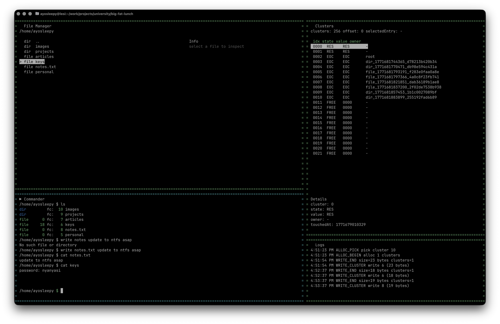

# big-fat-lunch v0.1 - FAT simulator

## Made by Ivan (ayo-sleepy) Kurbakov for RSREU, as a side project.

#### Usecase: educational practice

#### License: MIT

#### Stack: NodeJS, JavaScript, LokyJs, Chalk, Ink, Tsx, Nodemon, React.

_This readme was written for version 0.1 of big-fat-lunch, the project is currently in work and it's not recommended to use it as stable version due to lack of update capability in future. Currently there is NO any support of older versions. big-fat-lunch was not tested enough and is totally enthusiastic._

FAT (File Allocation Table) is a classical architecture of File System. Used by default in old operating system, for example: DOS, windows 9x, etc. This implementation of FAT simulation is NOT a total recreation of File System, but it aims to implement the processes of its usage.

There we have **4 workfields**:

_File Manager_
A simple read-only visual file & directory manager that reflects what appears during the simulation. Use it to navigate the tree and observe changes in real time (names, types, sizes, first cluster, etc.).

_Commander_
An interactive CLI workspace that simulates basic UNIX utilities. This is where you create, remove, move, copy, and modify entities (`mkdir`, `touch`, `rm`, `mv`, `cp`, `write`, `cat`). It is the main “driver” of the simulation.

_Clusters_
A detailed FAT table view (cluster map). It shows cluster states (FREE/RES/BAD/EOC/NEXT), links between clusters (chains), and ownership (which file/directory currently holds a cluster). This is the core visualisation of how FAT actually stores data.

_Logs_
A small, always-on, read-only event stream. It displays step-by-step actions produced by operations (allocation, linking, writing, freeing), so you can follow what happened without switching focus to it.

**Focus switching:** Space+1 (File Manager), Space+2 (Commander), Space+3 (Clusters). Logs are always visible and do not receive focus.
